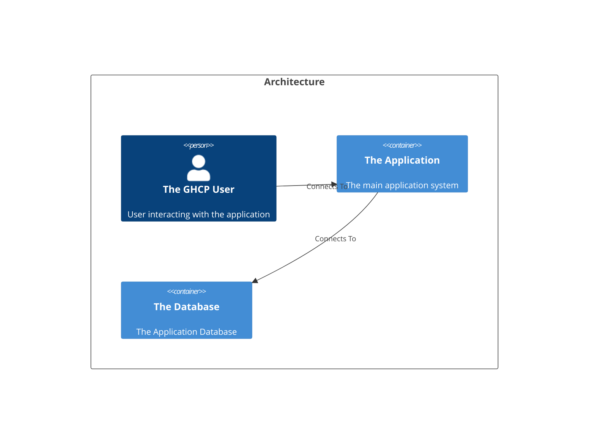

# Welcome to CALM Documentation

This documentation is generated from the **CALM Architecture-as-Code** model.

## High Level Architecture

## Nodes
    - [The GHCP User](nodes/ghcp-user)
    - [The Application](nodes/the-application)
    - [The Database](nodes/the-database)

## Relationships
    - [User To App](relationships/user-to-app)
    - [App To Database](relationships/app-to-database)

## Flows
     _No flows defined._

## Controls
  _No Controls defined._

## Metadata
  _No Metadata defined._

## Adrs
  _No Adrs defined._
