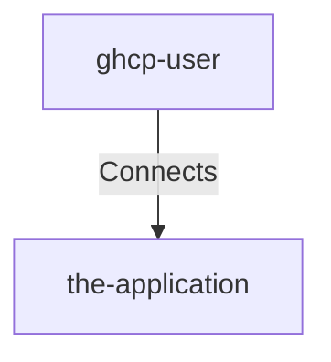

## Details

| Field               | Value                    |
|---------------------|--------------------------|
| **Unique ID**       | user-to-app                   |
| **Description**      |  User connects to the application   |

## Related Nodes

## Controls
    _No controls defined._

## Metadata
  _No Metadata defined._
